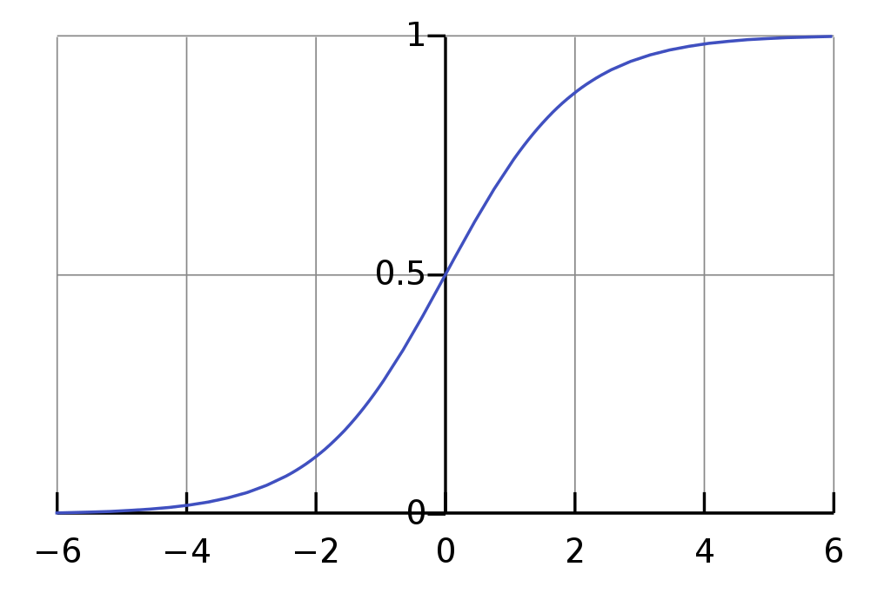

# Simplest Feedforward Neural Network
This work is an introduction of a basic feedforward neural network structure including activation function and also weight updating through backpropagation.

The neural network is trained with backpropagation for predict the output based on input given.

<table class="tg">
  <tbody><tr>
    <th class="tg-5rcs" colspan="3">Inputs</th>
    <th class="tg-5rcs">Output</th>
  </tr>
  <tr>
    <td class="tg-4kyz">0</td>
    <td class="tg-4kyz">0</td>
    <td class="tg-4kyz">1</td>
    <td class="tg-4kyz">0</td>
  </tr>
  <tr>
    <td class="tg-4kyz">1</td>
    <td class="tg-4kyz">1</td>
    <td class="tg-4kyz">1</td>
    <td class="tg-4kyz">1</td>
  </tr>
  <tr>
    <td class="tg-4kyz">1</td>
    <td class="tg-4kyz">0</td>
    <td class="tg-4kyz">1</td>
    <td class="tg-4kyz">1</td>
  </tr>
  <tr>
    <td class="tg-4kyz">0</td>
    <td class="tg-4kyz">1</td>
    <td class="tg-4kyz">1</td>
    <td class="tg-4kyz">0</td>
  </tr>
</tbody></table>

One of the important part in this codes is the non-linearity mapping functions. The sigmoid function maps any value to a value between 0 and 1. It to convert numbers to probabilities

<h3>General Sigmoid Function Equation</h3>

<h3>Graph of Sigmoid Activation Function</h3>

# Dependencies
<ul>
  <li>Numpy</li>
</ul>

# References
<ul>
  <li>https://en.wikipedia.org/wiki/Activation_function</li>
  <li>https://towardsdatascience.com/activation-functions-neural-networks-1cbd9f8d91d6</li>
  <li>https://iamtrask.github.io/2015/07/12/basic-python-network/</li>
</ul>

