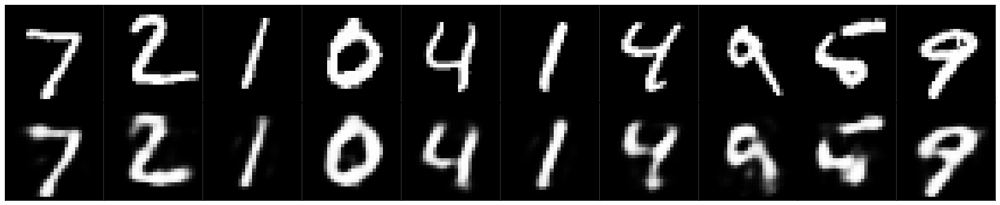

# Basic Encoder-decoder with MNIST dataset

This work is to practice the simple encoder and decoder method.
First, we encoded the MNIST image into matrix, then decoded it.

Output of decoder as shown as following in second row:

# Dependencies
<ul>
  <li>TensorFlow</li>
  <li>Numpy</li>
  <li>Matplotlib</li>
  <li>MNIST dataset</li>
</ul>
