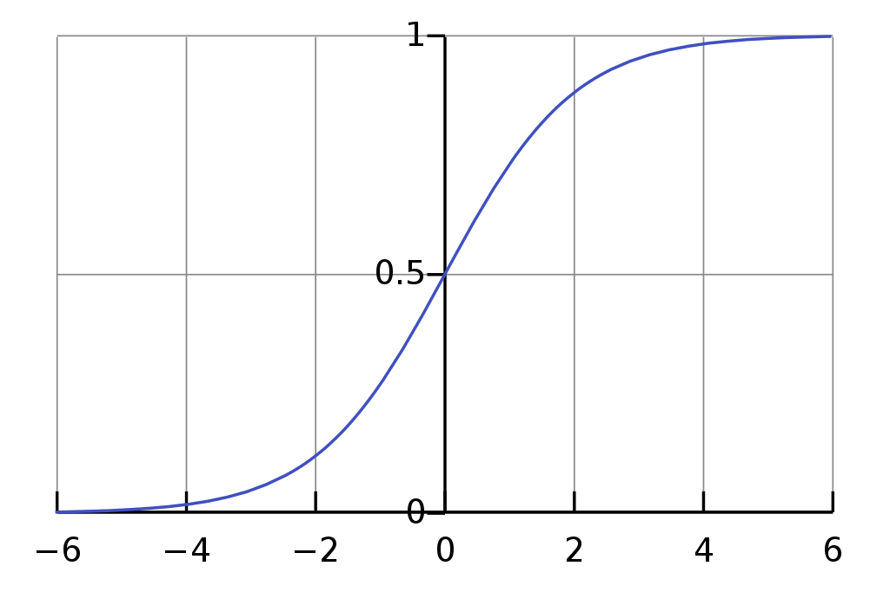

# Feedforward-Neural-Network

# Dependencies
<ul>
  <li>TensorFlow</li>
  <li>Keras</li>
  <li>Numpy</li>
  <li>Matplotlib</li>
  <li>Pandas</li>
</ul>

<h3>Graph of Sigmoid Activation Function</h3>

<h3>General Sigmoid Function Equation</h3>

# References
<ul>
  <li>https://en.wikipedia.org/wiki/Activation_function</li>
  <li>https://towardsdatascience.com/activation-functions-neural-networks-1cbd9f8d91d6</li>
</ul>
